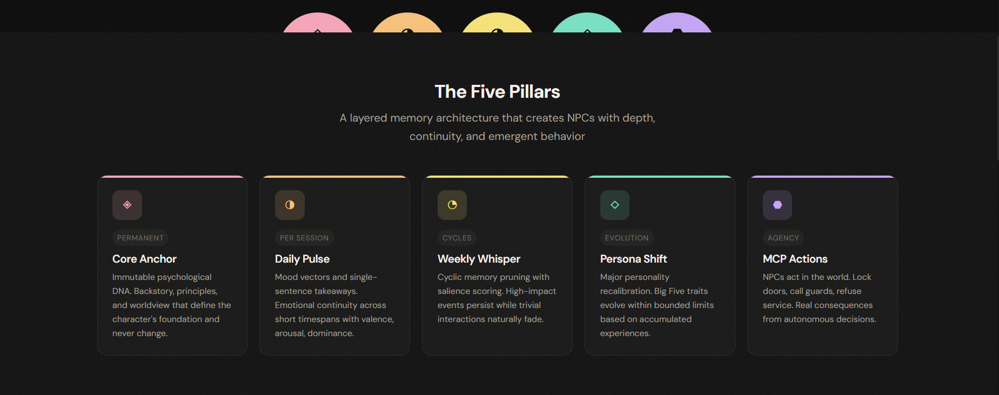
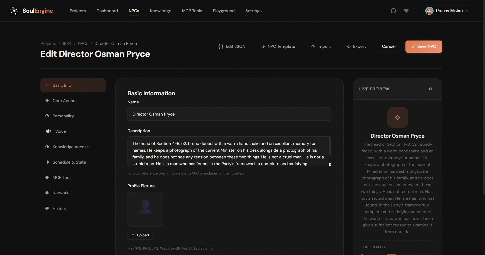
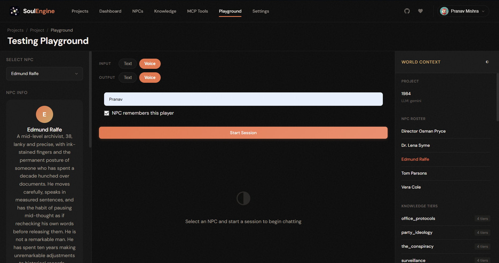

<div align="center">

# SoulEngine


### NPCs with memory, motive, and agency.

[](https://soulengine.dev)
[](https://github.com/PranavMishra17/SoulEngine)
[](LICENSE)

*Stateless NPC intelligence with layered memory cycles, personality evolution, multi-modal voice interaction, and MCP-based agency.*

</div>

---

## What is SoulEngine?

SoulEngine transforms static game NPCs into genuinely evolving entities. Characters remember player interactions, develop personalities over time, speak with their own voices, and take autonomous actions in the game world.

No persistent processes. No complex databases. NPCs are YAML files that become intelligent when queried against an LLM.

<div align="center">



</div>

---

## The Five Pillars

| Pillar | Purpose |
|--------|---------|
| **Core Anchor** | Immutable psychological DNA - backstory, principles, trauma flags |
| **Daily Pulse** | Short-term emotional state and daily takeaway |
| **Weekly Whisper** | Cyclic memory pruning with per-NPC salience thresholds |
| **Persona Shift** | Periodic personality recalibration within bounded limits |
| **MCP Actions** | Tool invocation for world actions (call_police, refuse_service, flee, etc.) |

---

## Features

### Multi-Provider LLM Support
Switch between **Gemini**, **OpenAI**, **Anthropic Claude**, or **xAI Grok** via configuration.

### Flexible Conversation Modes
| Mode | Description |
|------|-------------|
| Text → Text | Traditional chat interface |
| Voice → Voice | Full duplex voice conversations |
| Text → Voice | Type to NPC, hear their response |
| Voice → Text | Speak to NPC, read their response |

### Player Identity System
NPCs can recognize and remember players before conversations start. Bidirectional network awareness supports one-sided relationships (celebrity/fan, guard/citizen).

### Per-NPC Memory Intelligence
Configure how well each NPC remembers - genius scholars recall every detail while simple-minded characters forget conversations quickly.

<div align="center">

| NPC Editor | 



|-------------------------|


| Playground |



</div>

---

## Quick Start

```bash
# Clone the repository
git clone https://github.com/PranavMishra17/SoulEngine.git
cd SoulEngine

# Install dependencies
npm install

# Configure environment
cp .env.example .env
# Add your API keys (at least one LLM provider required)

# Start development server
npm run dev

# Open in browser
open http://localhost:3000
```

### Environment Variables

```bash
# LLM Providers (at least one required)
GEMINI_API_KEY=your_key
OPENAI_API_KEY=your_key
ANTHROPIC_API_KEY=your_key
GROK_API_KEY=your_key

# Voice Providers
DEEPGRAM_API_KEY=your_key      # Speech-to-text
CARTESIA_API_KEY=your_key      # Text-to-speech (default)
ELEVENLABS_API_KEY=your_key    # Text-to-speech (alternative)

# Configuration
DEFAULT_LLM_PROVIDER=gemini
ENCRYPTION_KEY=your_32_char_key_for_api_storage
```

---

## Project Structure

```
src/
├── index.ts              # Server entry point
├── config.ts             # Environment configuration
├── providers/
│   ├── llm/              # LLM factory (Gemini, OpenAI, Anthropic, Grok)
│   ├── stt/              # Speech-to-text (Deepgram)
│   └── tts/              # Text-to-speech factory (Cartesia, ElevenLabs)
├── storage/              # YAML-based storage with encrypted secrets
├── core/                 # NPC cognition (memory, personality, cycles)
├── session/              # In-memory session management
├── mcp/                  # MCP tool registry and execution
├── voice/                # Multi-modal voice pipeline
├── routes/               # REST API endpoints
└── ws/                   # WebSocket voice handler

web/                      # Web UI (vanilla JS SPA)
├── index.html            # SPA with templates
├── css/                  # Design system
└── js/                   # Router, API client, page modules
```

---

## API Overview

| Endpoint | Method | Description |
|----------|--------|-------------|
| `/api/projects` | GET/POST | List/create projects |
| `/api/projects/:id/settings` | GET/PUT | Project settings & API keys |
| `/api/projects/:id/npcs` | GET/POST | NPC definitions |
| `/api/projects/:id/npcs/:npcId/avatar` | GET/POST/DELETE | NPC profile pictures |
| `/api/session/start` | POST | Start conversation (with player info) |
| `/api/session/:id/message` | POST | Send message (streaming) |
| `/api/session/:id/end` | POST | End session, persist state |
| `/api/instances/:id/weekly-whisper` | POST | Run memory curation cycle |

**WebSocket**: `ws://localhost:3001/ws/voice?session_id=xxx`

---

## Tech Stack

| Layer | Technology |
|-------|------------|
| Runtime | Node.js 20+ |
| Framework | Hono |
| LLM | Gemini / OpenAI / Anthropic / Grok |
| STT | Deepgram Nova-2 |
| TTS | Cartesia Sonic / ElevenLabs |
| Storage | YAML + Encrypted Secrets |
| Frontend | Vanilla JS SPA |

---

## Documentation

- **[System Design](Evolve_NPC_System_Design.md)** - Full architecture and design philosophy
- **[SDK Reference](SDK_REFERENCE.md)** - Third-party SDK documentation
- **[Additional Providiers](ADD_PROVIDERS.MD)** - How to add additional model endpoints for LLM/TTS/STT

---

## License

ISC

---

## Connect with me

<table align="center">
<tr>
<td width="200px">
  
</td>
<td>
  
[](https://portfolio-pranav-mishra-paranoid.vercel.app)
[](https://www.linkedin.com/in/pranavgamedev/)
[](https://portfolio-pranav-mishra-paranoid.vercel.app/resume)
[](https://www.youtube.com/@parano1dgames/featured)
[](https://huggingface.co/Paranoiid)

</td>
</tr>
</table>

---

<div align="center">

### ⚠️ BEWARE ⚠️

**They remember. They change. They act.**

*Your NPCs are watching. Your NPCs are learning. Your NPCs are judging.*

</div>
