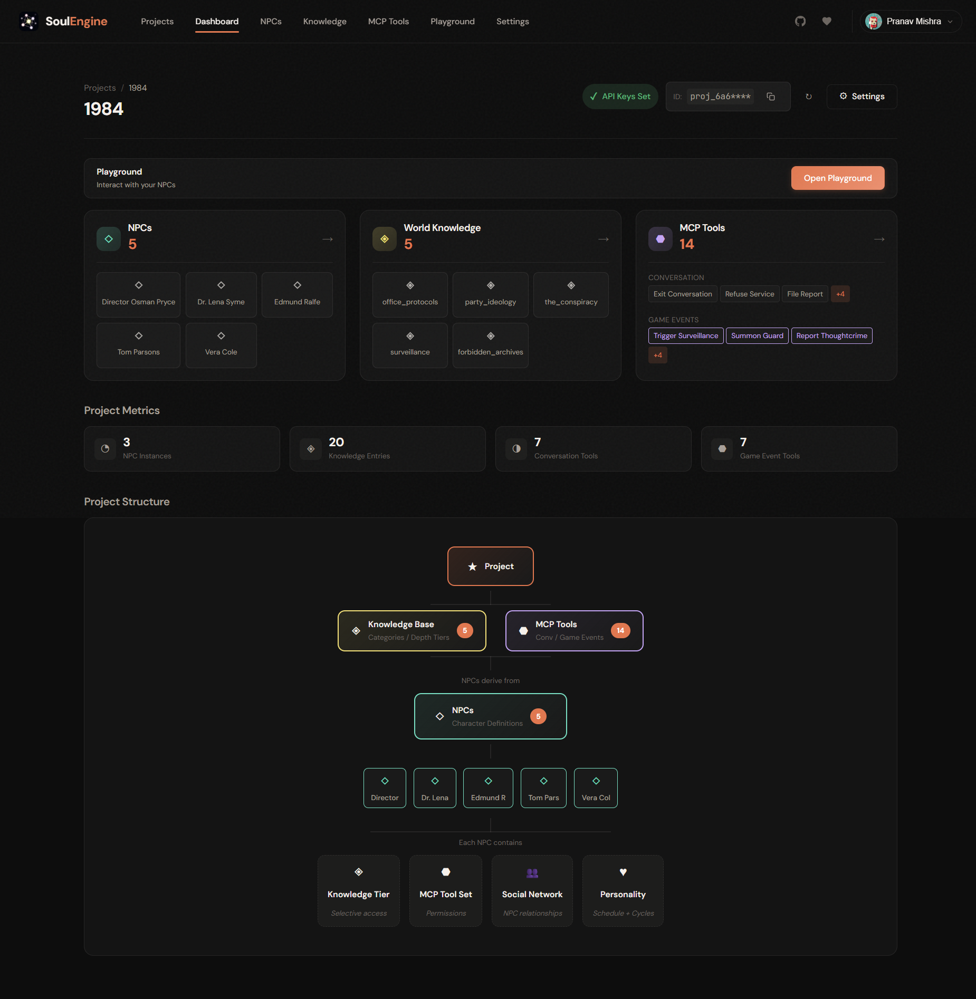

<div align="center">


[](https://soulengine.onrender.com)
[](https://bun.sh)
[](https://www.typescriptlang.org/)
[](LICENSE)

*Stateless NPC intelligence with layered memory cycles, personality evolution, dual-instance mind, multi-modal voice interaction, social networks, tiered knowledge-base and MCP-based agency.*

</div>

---

## What is SoulEngine?

SoulEngine transforms static game NPCs into genuinely evolving entities. Characters remember player interactions, develop personalities over time, speak with their own voices, and take autonomous actions in the game world. A **dual-instance Mind** lets the Speaker respond instantly while a parallel thinker reasons with tools in the background.

<div align="center">


</div>

---

## The Five Pillars of SoulEngine NPCs

| Pillar | Purpose |
|--------|---------|
| **Core Anchor** | Immutable psychological DNA — backstory, principles, trauma flags. Never modified by any system. |
| **Daily Pulse** | End-of-session emotional snapshot. 1-sentence takeaway. Carries mood continuity into next interaction. |
| **Weekly Whisper** | Cyclic memory pruning with LLM synthesis. STM is consolidated into insight-level LTM entries, not just moved verbatim. |
| **Persona Shift** | Periodic personality recalibration within bounded limits. Trait drift from sustained experiences. |
| **MCP Actions** | Tool invocation for world actions — call_police, refuse_service, flee, lock_door, alert_guards, exit_convo. |

---

## Features

    Unity SDK coming soon!

### Multi-Provider LLM, TTS, and STT

| Provider Type | Options | Default |
|---------------|---------|---------|
| **LLM** | Google Gemini, OpenAI, Anthropic Claude, xAI Grok | Gemini 2.0 Flash |
| **TTS** | Cartesia, ElevenLabs | Cartesia Sonic |
| **STT** | Deepgram Nova-2 | Deepgram |

Switch providers per-project. Use your own API keys (BYOK — encrypted at rest, never logged).

### Flexible Conversation Modes

| Mode | Input | Output |
|------|-------|--------|
| `text-text` | Keyboard | Text |
| `voice-voice` | Microphone | Speakers |
| `text-voice` | Keyboard | Speakers |
| `voice-text` | Microphone | Text |

### Memory Architecture

**Short-Term Memory (STM):** Created at session end from a detective-style LLM summary that captures specific facts, phrases, and names — not emotional atmosphere. Filtered against injection patterns while preserving legitimate player-shared content.

**Long-Term Memory (LTM):** Synthesized at weekly whisper time. Multiple STM entries are compressed by an LLM into condensed, insight-level observations. Raw entries are removed from STM after promotion — no duplication.

**Per-NPC Memory Retention:** Configurable `salience_threshold` per NPC. Low threshold = genius-level recall (2-sentence summaries, promotes more to LTM). High threshold = forgetful character (1-sentence summaries, most memories fade).

| Retention | Threshold | Character Type |
|-----------|-----------|----------------|
| 80-100% | 0.35-0.47 | Scholar, Elder, Detective |
| 40-60% | 0.59-0.71 | Average townsperson |
| 0-20% | 0.83-0.95 | Simple-minded NPC |

### Player Identity System

NPCs can be told who the player is before conversation starts:
- Player name, description, role, context
- Bidirectional network: "You know them" vs "You know of them (famous)"
- Relationship persistence: trust, familiarity, sentiment tracked per player

### NPC Social Graph

Each NPC has a configurable network of relationships with other NPCs, with tiered familiarity levels controlling what information they share in context:

| Tier | Information |
|------|-------------|
| 1 - Acquaintance | Name + brief description |
| 2 - Familiar | + backstory + schedule/location |
| 3 - Close | + personality traits + principles + trauma flags |

### Full Version History

Every state change creates a versioned snapshot — rollback is always available.

**NPC Definition History:** Every time you save changes to an NPC's personality, voice, backstory, etc., the previous version is archived. View field-level diffs, revert to any prior version.

**Mind State History:** Every session end, daily pulse, weekly whisper, and persona shift creates a snapshot of the NPC's runtime mind (mood, STM, LTM, trait modifiers, relationships). View any historical snapshot in the UI. Revert to any prior mind state.

### Security

- **Core Anchor immutability:** Enforced at the cycle logic layer and session integrity check. Modifications are detected and rejected.
- **Input sanitization:** XSS prevention, injection pattern detection. Quoted content preserved (doesn't strip legitimate player phrases).
- **Content moderation:** Keyword-based, triggers in-character conversation exit.
- **Rate limiting:** Per-player per-NPC per-minute.
- **Narration stripping:** `(stage directions)` and `*actions*` stripped from all LLM responses post-processing, both in text and voice modes.
- **Game Client API Key:** SHA-256 hashed. Required for external game clients (Unity), bypassed for authenticated dashboard users.

### MCP Tool System

Three tool types for different decision authorities:

| Tool Type | Who Decides | Example |
|-----------|------------|---------|
| Recall Tool | Mind (built-in) | `recall_npc` to fetch NPC details |
| Conversation Tool | Mind (from dialogue context) | `warn_player` when threatened |
| Game-Event Tool | Game code (bypasses Mind) | `flee_to` on explosion event |

Define tools once in the web UI, assign permissions per NPC, implement handlers in your game client.

### NPC Mind (Parallel Dual-Instance Architecture)

Every conversation turn runs two LLM instances **in parallel**:

| Instance | Role | Tools | Context |
|----------|------|-------|---------|
| **Speaker** | Immediate conversational voice | None | Slim context (Tier 1 network, no knowledge) |
| **Mind** | Parallel thinker with agent loop | All | Full tool access via recall + conversation tools |

**How it works:**
- Speaker streams the instant reply immediately -- zero latency from Mind, pure voice, no tool overhead.
- Mind runs in parallel, evaluating whether tools are needed and executing an agent loop if so.
- **Recall tools** (recall_npc, recall_knowledge, recall_memories): results are deferred and injected into the Speaker's prompt on the **next turn**. No follow-up speech, no added latency.
- **MCP/project tools** (request_credentials, lock_door, call_guards, etc.): trigger a short **follow-up speech** in the same turn addressing the action taken.
- Always on. No feature flag -- every turn benefits from the split.

**Tool ownership:**
- **Recall Tools** (built-in): `recall_npc`, `recall_knowledge`, `recall_memories` -- Mind fetches context on demand; results deferred to next turn's prompt.
- **Conversation Tools** (project-defined): `warn_player`, `call_police`, etc. -- Mind decides when to invoke them; results produce a brief follow-up response.

**Cost control:** Mind LLM provider and model are configurable per project (defaults to the project LLM). The slim Speaker context achieves 29-57% token savings vs the previous full-context approach.

---

## Web UI

Full management and testing interface — no build step required.

<div align="center">

| Dashboard |



| NPC Editor |


| Playground |


</div>

### NPC Editor (9 tabs)

1. **Basic Info** — Name, description, profile picture, draft/complete status
2. **Core Anchor** — Backstory, principles, trauma flags
3. **Personality** — Big Five sliders, preset archetypes, memory retention slider
4. **Voice** — Provider, voice browser with previews, speed control
5. **Knowledge** — Depth-level knowledge access assignment per category
6. **Schedule** — Time-block routines (location + activity)
7. **MCP Tools** — Conversation and game-event tool permissions
8. **Network** — NPC social graph with familiarity tiers and mutual/one-sided awareness
9. **History** — Mind state snapshots + definition version timeline, both with revert buttons

### Testing Playground

- 4 conversation modes
- Live NPC State panel: real-time mood bars, memory counts, latest memory, daily pulse
- Cycle trigger panel: run daily pulse / weekly whisper / persona shift from the UI
- World Context panel: project overview, NPC roster, knowledge tiers, available tools
- Player identity configuration per session

### Project Settings

- LLM/TTS/STT provider configuration
- Mind LLM provider, model, and timeout configuration (defaults to project LLM)
- Per-project API key management (encrypted)
- Game Client API Key generation and revocation
- Import API keys from another project
- Project limits and timeout configuration

---

## Quick Start

```bash
# Clone the repository
git clone https://github.com/PranavMishra17/SoulEngine.git
cd SoulEngine

# Install dependencies
npm install

# Configure environment
cp .env.example .env
# Add your API keys (at least one LLM provider required)

# Start development server
npm run dev

# Open in browser
open http://localhost:3000
```

### Environment Variables

```bash
# LLM Providers (at least one required)
GEMINI_API_KEY=your_key
OPENAI_API_KEY=your_key
ANTHROPIC_API_KEY=your_key
GROK_API_KEY=your_key

# Voice Providers
DEEPGRAM_API_KEY=your_key      # Speech-to-text
CARTESIA_API_KEY=your_key      # Text-to-speech (default)
ELEVENLABS_API_KEY=your_key    # Text-to-speech (alternative)

# Configuration
DEFAULT_LLM_PROVIDER=gemini
ENCRYPTION_KEY=your_32_char_key_for_api_storage

# Production (Supabase)
SUPABASE_URL=your_url
SUPABASE_SERVICE_ROLE_KEY=your_key
```

---

## Project Structure

```
src/
+-- index.ts              # Server entry point
+-- config.ts             # Environment configuration
+-- providers/
|   +-- llm/              # LLM factory (Gemini, OpenAI, Anthropic, Grok)
|   +-- stt/              # Speech-to-text (Deepgram)
|   +-- tts/              # Text-to-speech (Cartesia, ElevenLabs)
+-- storage/              # Dual-backend storage (local filesystem + Supabase)
+-- core/                 # NPC cognition (memory, personality, cycles, summarizer, mind)
+-- session/              # In-memory session management
+-- mcp/                  # MCP tool registry and execution
+-- voice/                # Multi-modal voice pipeline
+-- security/             # Sanitizer, moderator, rate limiter
+-- routes/               # REST API endpoints
+-- ws/                   # WebSocket voice handler

web/                      # Web UI (vanilla JS SPA, no build step)
+-- index.html            # SPA with all page templates
+-- css/                  # Design system
+-- js/                   # Router, API client, page modules
```

---

## API Overview

### Session & Conversation

| Method | Endpoint | Description |
|--------|----------|-------------|
| POST | `/api/session/start` | Start conversation |
| POST | `/api/session/:id/end` | End session, persist memory |
| POST | `/api/session/:id/message` | Send message, get streaming response |
| GET | `/api/session/:id/history` | Get conversation history |

### Memory Cycles

| Method | Endpoint | Description |
|--------|----------|-------------|
| POST | `/api/instances/:id/daily-pulse` | Capture daily mood + takeaway |
| POST | `/api/instances/:id/weekly-whisper` | Consolidate STM, synthesize to LTM |
| POST | `/api/instances/:id/persona-shift` | Recalibrate personality from experiences |

### Mind State History

| Method | Endpoint | Description |
|--------|----------|-------------|
| GET | `/api/instances/:id/history` | List all mind state snapshots |
| GET | `/api/instances/:id/history/:version` | Fetch snapshot at version |
| POST | `/api/instances/:id/rollback` | Restore mind state to version |

### Projects & NPCs

| Method | Endpoint | Description |
|--------|----------|-------------|
| GET/POST | `/api/projects` | List/create projects |
| GET/PUT/DELETE | `/api/projects/:id` | Project CRUD |
| GET/PUT | `/api/projects/:id/keys` | API key management |
| GET/POST | `/api/projects/:id/npcs` | List/create NPC definitions |
| GET/PUT/DELETE | `/api/projects/:id/npcs/:npcId` | NPC CRUD |
| POST/GET/DELETE | `/api/projects/:id/npcs/:npcId/avatar` | Profile picture |
| GET | `/api/projects/:id/npcs/:npcId/history` | Definition version list |
| POST | `/api/projects/:id/npcs/:npcId/rollback` | Revert NPC definition |
| GET/PUT | `/api/projects/:id/knowledge` | Knowledge base |
| GET/PUT | `/api/projects/:id/mcp-tools` | MCP tool definitions |

**WebSocket**: `ws://localhost:3001/ws/voice?session_id=xxx`

---

## Tech Stack

| Layer | Technology |
|-------|------------|
| Runtime | Node.js 20+ / Bun / **TypeScript** |
| Framework | Hono |
| LLM | Gemini / OpenAI / Anthropic / Grok |
| STT | Deepgram Nova-2 |
| TTS | Cartesia Sonic / ElevenLabs |
| Storage | Local JSON + Supabase PostgreSQL |
| Frontend | Vanilla JS / CSS3 / HTML5 |

---

## Documentation

- **[System Design](documentation/Evolve_NPC_System_Design.md)** — Full architecture, all design decisions, and implementation details
- **[Chat Interface](documentation/CHAT_interface.md)** — Voice and text chat interface, details of VAD, Mind State, MCP tools, Streaming
- **[Unity SDK](documentation/UNITY_REPACKAGE.md)** — Unity integration plan, scene setup guide, feature mapping
- **[Add Providers](documentation/ADD_PROVIDERS.MD)** — How to add additional LLM/TTS/STT providers

---

## License

**[Academic/Research Use Only](LICENSE)**

---

## Connect with me

<table align="center">
<tr>
<td width="200px">
  
</td>
<td>

[](https://portfolio-pranav-mishra-paranoid.vercel.app)
[](https://www.linkedin.com/in/pranavgamedev/)
[](https://portfolio-pranav-mishra-paranoid.vercel.app/resume)
[](https://www.youtube.com/@parano1dgames/featured)
[](https://huggingface.co/Paranoiid)

</td>
</tr>
</table>

---

<div align="center">

**They listen. They remember. They act...**

</div>

